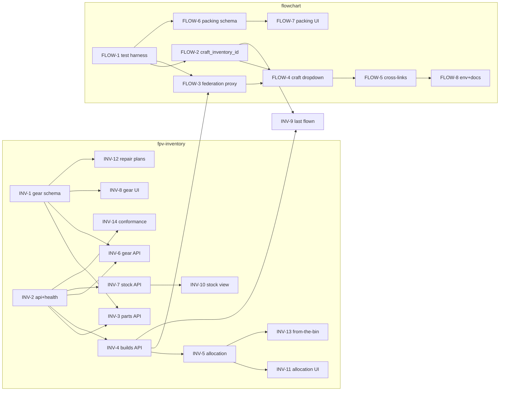

# FPVibe — v1.0 Architecture Implementation Plan

Status: Active · companion to [ARCHITECTURE.md](ARCHITECTURE.md) and [API-CONTRACT.md](API-CONTRACT.md)
Audience: implementing agents (Claude Code, opencode, Hermes) and future-Cori

This plan turns ARCHITECTURE.md §10 (Implementation priorities) into discrete,
self-verifiable GitHub issues across the FPVibe org. Every task below is filed
as a GitHub issue in the repo where the work happens; the issue is the unit of
work, claiming, and resumption. This document is the authoritative spec each
issue links back to.

---

## 1. How to work this plan

### 1.1 Rules of engagement

All work follows [CLAUDE.md](CLAUDE.md) (derived from `cori/claude-code-base`):

- **Red-Green-Refactor.** Failing test committed first (`test:`), minimal
  implementation (`feat:`), then cleanup (`refactor:`). Conventional commits.
- **No React.** Vanilla JS/TS, server-rendered HTML or template literals,
  progressive enhancement. Respect each repo's existing stack.
- **Mobile-responsive, dark-default** UI using the §9 palette
  (primary `#9ecae1`, secondary `#9e7bb5`, accent `#f08a3c`).
- **Commit early and often.** No session URLs / agent names / model IDs in
  the prose of commits, PR bodies, or code comments — machine-readable
  commit trailers (`Co-Authored-By:`, `Claude-Session:`) are exempt.
- **PRs reference their issue** with `Resolves #N` so merge closes it.
- **Copilot review loop.** Every PR gets a Copilot review on creation;
  address or answer every comment and re-request review after pushing
  fixes (CLAUDE.md § Copilot Review Loop).
- **Federation guardrails** (ARCHITECTURE.md §11): no shared DB/filesystem,
  cross-tool calls read-only + degradable, no auth, one job per tool.

### 1.2 Picking up work (resumability protocol)

Work is sized so any single issue fits comfortably in one agent session and
survives a pause mid-stream:

0. **Interrupts first.** Check for open `bug`-labeled issues in the repo
   you're about to work in and in `FPVibe/docs`. Any open `bug` preempts
   plan work (§1.6).
1. Open the **master tracking issue** in `FPVibe/docs` (see §6). Find the first
   unchecked issue whose dependencies (its `Depends on:` line) are all closed
   **and whose phase is unlocked** — the previous build stream's human
   checkpoint must be closed (§1.5).
2. Comment on the issue that you're picking it up. Branch from the target
   repo's default branch: `issue-<N>-<slug>`.
3. Work TDD. Push the branch **even when incomplete** — a pushed branch with a
   red test and a WIP draft PR is a valid pause point; note the stopping point
   in a PR comment so the next agent (or you, later) can resume.
4. Before marking done: run the issue's **Verification** block verbatim. Every
   command must pass. Then open/finalize the PR with `Resolves #N` and get CI
   green.
5. Run the **Copilot review loop** (CLAUDE.md § Copilot Review Loop): request
   a Copilot review, fix or answer every comment, re-request review after
   each push of fixes, exit when a round comes back clean (cap: three
   rounds). Then merge (or leave for review per repo norms) and tick the box
   on the tracking issue.
6. If an issue turns out to be wrong or blocked, don't silently skip: comment
   on it with what you found, and note it on the tracking issue.

Dependencies are referenced by **plan ID** (`INV-2`, `FLOW-1`, …), which map to
issue numbers in the index table (§3). Plan IDs are stable even if issue
numbers shift.

### 1.3 Definition of Done (every issue)

- New/changed behavior covered by tests (repo's harness; see bootstrap issues)
- Full test suite and CI green
- Issue's Verification block passes verbatim
- Copilot review loop completed: a review round came back clean, or the
  remaining disagreement is summarized in a PR comment
- Docs touched by the change updated in the same PR (README, AGENTS.md,
  API-CONTRACT.md via a `FPVibe/docs` PR when a contract shape changes)
- Conventional commits; PR body has summary + test plan + `Resolves #N`

### 1.4 CI baseline (per repo)

Every FPVibe repo runs its checks in GitHub Actions on every push and PR —
"CI green" in §1.3 presumes CI exists. Current state:

| Repo | Workflow | Runs | Gap |
|------|----------|------|-----|
| fpv-inventory | `ci.yml` | `deno test --allow-all` | — |
| flowchart | `ci.yml` | bash smoke tests; FLOW-1 adds `npm test` before them | unit tests until FLOW-1 lands |
| fpv-tools | `test.yml` | `deno fmt --check` + `deno test` | — |
| docs | — | none | [DOCS-6 / docs#11](https://github.com/FPVibe/docs/issues/11): link check, shellcheck, compose validation |

Rules:

- If your change isn't exercised by the repo's existing CI (new script type,
  new runtime step), **extend the workflow in the same PR** — don't leave a
  gap for the next agent.
- New repos (DOCS-4's `FPVibe/skills`, DOCS-5's `fpvibe.github.io`) ship a
  CI workflow in their **first** PR.

### 1.5 Human checkpoints (verify early, correct early)

Agents self-verify per issue, but only a human running the real install
catches "technically passes, actually wrong." Checkpoint issues — filed in
`FPVibe/docs`, owned by Cori — sit between build streams; each is a
walk-through of the live Runtipi deployment:

| Checkpoint | After | Gates | Issue |
|------------|-------|-------|-------|
| CHECK-1 | Phase 1 | Phase 2 buildout | [docs#12](https://github.com/FPVibe/docs/issues/12) |
| CHECK-2 | Phases 2–3 | Phases 4–5 buildout | [docs#13](https://github.com/FPVibe/docs/issues/13) |
| CHECK-3 | Phases 4–5 | v1.0 sign-off | [docs#14](https://github.com/FPVibe/docs/issues/14) |
| CHECK-4 | Phases 6–7 + all above | closing the tracking issue | [docs#15](https://github.com/FPVibe/docs/issues/15) |

Rules:

- A gated phase's buildout **must not start** until its checkpoint issue is
  closed. Exempt (may run anytime): repo-internal bootstrap and
  documentation work — FLOW-1, the DOCS-* issues, TOOLS-1/2, and Phases 6–7
  generally.
- Closing is the gate, not ceremony: Cori can close a checkpoint with a
  "skipped" comment to waive it consciously.
- Findings during a checkpoint become `bug` issues (§1.6) and preempt
  further buildout.

### 1.6 Interrupts: broken beats buildout

- Anything found broken — by Cori, by an agent, or during a checkpoint —
  gets an issue **labeled `bug`** in the affected repo (`INTERRUPT:` title
  prefix optional, for scanability).
- Pickup rule (step 0 of §1.2): an open `bug` issue takes precedence over
  feature buildout — oldest first unless Cori says otherwise.
- Bug fixes follow the same discipline: failing test reproducing the bug
  first, then the fix, CI green, Copilot loop, `Resolves #N`.
- If a bug invalidates in-flight feature work, say so in a comment on the
  affected issue(s) before fixing.

### 1.7 Course corrections (when the architecture is wrong)

Implementation will eventually contradict the spec. ARCHITECTURE.md and
API-CONTRACT.md are canon **until amended** — never silently deviate. When
an issue's spec can't work as written (or would clearly be worse built as
specified):

1. **Stop** work on the affected issue; comment what you found — evidence,
   not vibes.
2. **File** an issue in `FPVibe/docs` titled `ARCH: <problem>`: the
   conflict, the options considered, one recommendation. Link the blocked
   issue(s).
3. **Cori decides** on that issue. This is deliberately a human gate — no
   agent re-architects the federation unilaterally.
4. **Land the decision** as a docs PR: amend ARCHITECTURE.md (§12 record)
   and/or API-CONTRACT.md, add a CHANGELOG entry, bump the affected tool's
   contract version if a response shape changes, and update this plan and
   the affected issues.
5. **Resume** the blocked work against the amended spec.

Small ambiguities that don't contradict the docs don't need this — use
judgment and note the choice in the PR. The bar for an `ARCH:` issue is
"the documented design can't work as specified," not "I'd have done it
differently."

---

## 2. Decisions adopted

ARCHITECTURE.md §12 and API-CONTRACT.md §7 left open decisions. This plan
adopts the following resolutions (DOCS-1 folds them back into those docs).
They are binding for all issues below.

| # | Decision | Resolution |
|---|----------|------------|
| D1 | flowchart `equipment` table | **Keep, scoped as session-event log.** Inventory owns "what exists"; flowchart's `equipment`/`equipment_log` records what happened during sessions. No schema removal; document the boundary (FLOW-8, DOCS-1). |
| D2 | Gear representation | **Add `gear` to the parts `type` enum** plus nullable columns `serial_number`, `warranty_expiry`, `purchase_date`, `purchase_price` on `parts`. Commercial serial/warranty-bearing assets only; DIY accessories stay Parts. (INV-1) |
| D3 | Tune profiles | **No server-side home yet.** Stays in fpv-tools localStorage. Out of scope. |
| D4 | fpv-tools → fpvibe.github.io | **Migrate.** Repo already lives in the org; verify/enable Pages at `fpvibe.github.io/fpv-tools`, fix hardcoded URLs, redirect stub from the old location is a manual Cori step (TOOLS-1). |
| D5 | IGOW reference data | **Stays client-side** in fpv-tools until training promotes. Out of scope. |
| D6 | Packing list owner | **flowchart.** Packing is session-type-driven. (FLOW-6, FLOW-7) |
| D7 | Marketplace repo name | **`FPVibe/skills`.** (DOCS-4) |
| D8 | Browser-reachable URLs / CORS | **Option (a): server-side proxy.** Browser code only ever fetches its own origin; each tool's server makes the cross-tool call using the Docker-network env var (`INVENTORY_URL`, `SESSIONS_URL`). No CORS headers anywhere. Rendered cross-tool **links** use separate browser-facing env vars `INVENTORY_PUBLIC_URL` / `SESSIONS_PUBLIC_URL`; when unset, render plain text instead of a link. (FLOW-3, FLOW-5, INV-9) |
| D9 | BOM `role` field (contract §7.6) | **Return `null`** (contract already permits this). No `role` column now. |
| D10 | `POST /api/sessions` accepts `craft_inventory_id` (contract §7.1) | **Yes.** (FLOW-2) |
| D11 | `POST /api/builds` create-from-components endpoint (contract §7.2) | **Deferred.** From-the-bin is an inventory-internal HTML flow (INV-13); no public JSON write endpoint yet. |

---

## 3. Issue index

Streams: **INV** = `FPVibe/fpv-inventory` · **FLOW** = `FPVibe/flowchart` ·
**DOCS** = `FPVibe/docs` · **TOOLS** = `FPVibe/fpv-tools`.
Phases refer to ARCHITECTURE.md §10. The Issue column is filled in once issues
are filed.

| Plan ID | Repo | Title | Phase | Depends on | Issue |
|---------|------|-------|-------|------------|-------|
| DOCS-1 | docs | Record adopted decisions in ARCHITECTURE/API-CONTRACT; add CHANGELOG | — | — | [docs#5](https://github.com/FPVibe/docs/issues/5) |
| DOCS-2 | docs | Conformance check script + federation smoke compose | — | — | [docs#6](https://github.com/FPVibe/docs/issues/6) |
| DOCS-6 | docs | CI for the docs repo (link check, shellcheck, compose validation) | — | — | [docs#11](https://github.com/FPVibe/docs/issues/11) |
| INV-1 | fpv-inventory | Gear schema migration (`gear` type + 4 columns) | 1 | — | [fpv-inventory#37](https://github.com/FPVibe/fpv-inventory/issues/37) |
| INV-2 | fpv-inventory | JSON API scaffolding + `GET /api/health` | 1 | — | [fpv-inventory#38](https://github.com/FPVibe/fpv-inventory/issues/38) |
| INV-3 | fpv-inventory | `GET /api/parts`, `GET /api/parts/:id` | 1 | INV-1, INV-2 | [fpv-inventory#39](https://github.com/FPVibe/fpv-inventory/issues/39) |
| INV-4 | fpv-inventory | `GET /api/builds`, `GET /api/builds/:id` | 1 | INV-2 | [fpv-inventory#40](https://github.com/FPVibe/fpv-inventory/issues/40) |
| INV-5 | fpv-inventory | Allocation engine + `/bom` + `/allocation` | 1, 4 | INV-4 | [fpv-inventory#41](https://github.com/FPVibe/fpv-inventory/issues/41) |
| INV-6 | fpv-inventory | `GET /api/gear`, `GET /api/gear/:id` | 1 | INV-1, INV-2 | [fpv-inventory#42](https://github.com/FPVibe/fpv-inventory/issues/42) |
| INV-7 | fpv-inventory | `GET /api/stock` | 1, 4 | INV-2 | [fpv-inventory#43](https://github.com/FPVibe/fpv-inventory/issues/43) |
| INV-8 | fpv-inventory | Gear UI (create/edit serial+warranty fields) | 1 | INV-1 | [fpv-inventory#44](https://github.com/FPVibe/fpv-inventory/issues/44) |
| FLOW-1 | flowchart | Test harness bootstrap (node:test, exported app) | 2 | — | [flowchart#28](https://github.com/FPVibe/flowchart/issues/28) |
| FLOW-2 | flowchart | `craft_inventory_id` + session query params + health `name` | 2 | FLOW-1 | [flowchart#29](https://github.com/FPVibe/flowchart/issues/29) |
| FLOW-3 | flowchart | Federation proxy: `/api/federation/builds` + `/api/federation/config` | 2 | FLOW-1, INV-4 | [flowchart#30](https://github.com/FPVibe/flowchart/issues/30) |
| FLOW-4 | flowchart | Craft dropdown with degradation (fetch → cache → fallback) | 2 | FLOW-2, FLOW-3 | [flowchart#31](https://github.com/FPVibe/flowchart/issues/31) |
| FLOW-5 | flowchart | Cross-tool links via `INVENTORY_PUBLIC_URL` | 2 | FLOW-4 | [flowchart#32](https://github.com/FPVibe/flowchart/issues/32) |
| INV-9 | fpv-inventory | "Last flown" on build detail via `SESSIONS_URL` | 3 | INV-4, FLOW-2 | [fpv-inventory#45](https://github.com/FPVibe/fpv-inventory/issues/45) |
| INV-10 | fpv-inventory | Stock check view (UI) | 4 | INV-7 | [fpv-inventory#46](https://github.com/FPVibe/fpv-inventory/issues/46) |
| INV-11 | fpv-inventory | Allocation surfacing in part/build UI | 4 | INV-5 | [fpv-inventory#47](https://github.com/FPVibe/fpv-inventory/issues/47) |
| INV-12 | fpv-inventory | Repair plan entity + UI | 4 | INV-1 | [fpv-inventory#48](https://github.com/FPVibe/fpv-inventory/issues/48) |
| INV-13 | fpv-inventory | From-the-bin guided build flow | 4 | INV-5 | [fpv-inventory#49](https://github.com/FPVibe/fpv-inventory/issues/49) |
| INV-14 | fpv-inventory | Runtipi/Docker conformance + README rewrite | 5-gate, 7 | INV-2 | [fpv-inventory#50](https://github.com/FPVibe/fpv-inventory/issues/50) |
| FLOW-6 | flowchart | Packing list schema + API | 5 | FLOW-1 | [flowchart#33](https://github.com/FPVibe/flowchart/issues/33) |
| FLOW-7 | flowchart | Packing list seed data + checklist UI | 5 | FLOW-6 | [flowchart#34](https://github.com/FPVibe/flowchart/issues/34) |
| FLOW-8 | flowchart | Federation env plumbing + docs hygiene | 2, 7 | FLOW-5 | [flowchart#35](https://github.com/FPVibe/flowchart/issues/35) |
| DOCS-4 | docs | Create `FPVibe/skills` marketplace + blackbox skill entry | 6 | — | [docs#8](https://github.com/FPVibe/docs/issues/8) |
| DOCS-3 | docs | Refresh fpvibe-context.md + provenance | 7 | — | [docs#7](https://github.com/FPVibe/docs/issues/7) |
| DOCS-5 | docs | `fpvibe.github.io` org landing page | 7 | — | [docs#9](https://github.com/FPVibe/docs/issues/9) |
| TOOLS-1 | fpv-tools | Pages migration to `fpvibe.github.io/fpv-tools` | 7 | — | [fpv-tools#24](https://github.com/FPVibe/fpv-tools/issues/24) |
| TOOLS-2 | fpv-tools | Optional: nginx-in-Tipi dual deploy | backlog | TOOLS-1 | [fpv-tools#25](https://github.com/FPVibe/fpv-tools/issues/25) |

### Dependency graph



Parallelizable from day one: `INV-1`, `INV-2`, `FLOW-1`, `DOCS-1`, `DOCS-2`,
`DOCS-3`, `DOCS-4`, `DOCS-5`, `TOOLS-1` have no dependencies.

---

## 4. Issue specifications

Everything an implementing agent needs is in the filed issue; these sections
carry the full detail the issues link to. File paths reference the repo the
issue lives in.

---

### DOCS-1 — Record adopted decisions; add CHANGELOG

**Repo:** `FPVibe/docs` · **Phase:** — · **Depends on:** none

Fold §2 of this plan back into the spec documents so the spec is
self-contained.

**Tasks**

1. ARCHITECTURE.md §12: replace each open decision with its resolution
   (D1–D8), marked "Resolved" with a one-line rationale; keep the original
   question text for context.
2. API-CONTRACT.md §7: same for questions 1, 2, 6, 7 (D10, D11, D9, D8).
   For §7.7 specify the proxy pattern: browser fetches same-origin
   `/api/federation/*`; servers use `INVENTORY_URL`/`SESSIONS_URL`; rendered
   links use `*_PUBLIC_URL` or degrade to plain text. Document flowchart's
   federation envelope (see FLOW-3) as a **tool-internal** endpoint, not part
   of the cross-tool contract.
3. Add `CHANGELOG.md`: dated entries; first entry records v1.0 contract +
   these resolutions.
4. Update README.md doc table (add CHANGELOG, this plan, CLAUDE.md).

**Verification**

```bash
test "$(grep -c 'Resolved' ARCHITECTURE.md)" -ge 8
test -f CHANGELOG.md
grep -q "INVENTORY_PUBLIC_URL" API-CONTRACT.md
```

---

### DOCS-2 — Conformance check script + federation smoke compose

**Repo:** `FPVibe/docs` · **Phase:** — · **Depends on:** none (usable
incrementally as endpoints land)

The self-verification backbone: a script any agent or CI job can run against a
live tool to prove contract conformance, plus a compose file that stands up
both tools federated for an end-to-end smoke test.

**Tasks**

1. `conformance/check.sh <base-url> <inventory|flowchart>` — bash + curl + jq.
   Asserts, per API-CONTRACT.md:
   - `/api/health` → `.status == "ok"`, `.name` matches tool, `.version` non-empty
   - inventory: `/api/builds` is an array; if non-empty, first element has
     `id,name,type,status,quantity`; `/api/parts` is an array; `/api/stock`
     is an array of `{type,status,total_quantity,count}`; `/api/gear` is an
     array; `/api/builds/999999` → HTTP 404 with `{error}`;
     `/api/builds/<first-id>/bom` rows have `part_id,qty_in_build,on_hand,allocated,free`
   - flowchart: `/api/sessions?limit=1` is an array of length ≤ 1;
     `/api/sessions/999999` → 404 `{error}`; list elements (if any) include
     `craft_inventory_id` key (may be null)
   - Endpoints not yet implemented: report as FAIL — the script's pass list
     grows as Phase 1/2 issues land; a flag `--phase 1|2|full` gates which
     assertions run so it's useful before everything ships.
   - Exit non-zero on any failure; print a readable PASS/FAIL table.
2. `conformance/docker-compose.federation.yml` — runs
   `ghcr.io/fpvibe/fpv-inventory` and `ghcr.io/fpvibe/flowchart` (current
   tags) on one network with `INVENTORY_URL`/`SESSIONS_URL` wired, ports
   published to localhost.
3. `conformance/README.md` — how to run both, including the end-to-end pass:
   compose up → `check.sh http://localhost:8000 inventory` →
   `check.sh http://localhost:3000 flowchart` → curl flowchart's
   `/api/federation/builds` and assert it relays inventory data.

**Verification**

```bash
shellcheck conformance/check.sh
docker compose -f conformance/docker-compose.federation.yml config -q
# Against any running flowchart (pre-Phase-2 use --phase 1):
# conformance/check.sh http://localhost:3000 flowchart --phase 1
```

---

### INV-1 — Gear schema migration

**Repo:** `FPVibe/fpv-inventory` · **Phase:** 1 · **Depends on:** none

Implements D2. `db.ts` currently defines
`PartType = "motor" | ... | "craft" | "other"` and `runMigrations()` already
does PRAGMA-guarded additive column adds — extend both.

**Tasks (TDD: extend `tests/db.test.ts` first)**

1. Add `"gear"` to the `PartType` union.
2. `runMigrations()`: add nullable columns to `parts` when missing:
   `serial_number TEXT`, `warranty_expiry TEXT`, `purchase_date TEXT`
   (ISO `YYYY-MM-DD` strings), `purchase_price REAL`.
3. Extend `Part`, `CreatePartInput`, `UpdatePartInput` and the
   `createPart`/`getPart`/`listParts`/`updatePart` column lists to carry the
   four fields (nullable everywhere; non-gear parts simply leave them null).
4. Tests: migration is idempotent (call `initDb` twice on the same file);
   fresh DB has the columns; create/read/update a `type: "gear"` part with
   all four fields round-trips; existing fixtures still pass.

**Out of scope:** any UI (INV-8), any API endpoint (INV-6).

**Verification**

```bash
deno task test
git ls-files '*.ts' | xargs deno check
```

---

### INV-2 — JSON API scaffolding + `GET /api/health`

**Repo:** `FPVibe/fpv-inventory` · **Phase:** 1 · **Depends on:** none

`main.ts` is a single `makeHandler(db)` matching HTML routes. Add a JSON API
layer without disturbing them.

**Tasks (TDD: new `tests/api.test.ts` using `makeHandler` with `new DB()` in-memory)**

1. New `api.ts` exporting `handleApi(db: DB, req: Request, url: URL): Response | null`.
   `makeHandler` calls it first for any path starting `/api/`; `null` falls
   through to 404 (HTML routes never start with `/api/`).
2. Helpers in `api.ts`: `json(data, status = 200)` setting
   `Content-Type: application/json; charset=utf-8`; errors are
   `{ "error": "<message>" }` with 404/500 per API-CONTRACT.md §1.
3. New `version.ts` with `export const VERSION = "1.0.0"` (bump per
   CLAUDE.md when contract shapes change later).
4. `GET /api/health` → `{ status: "ok", version: VERSION, name: "fpv-inventory" }`.
5. Tests: health shape; unknown `/api/nope` → 404 JSON `{error}` (not HTML);
   HTML routes still serve (spot-check `GET /` returns `text/html`).

**Verification**

```bash
deno task test
DB_PATH=/tmp/inv-test.db deno run --allow-all main.ts & SERVER_PID=$!
sleep 1
curl -sf http://localhost:8000/api/health | jq -e '.status=="ok" and .name=="fpv-inventory" and (.version|length>0)'
kill $SERVER_PID
```

---

### INV-3 — `GET /api/parts` + `GET /api/parts/:id`

**Repo:** `FPVibe/fpv-inventory` · **Phase:** 1 · **Depends on:** INV-1, INV-2

API-CONTRACT.md §3.4/§3.5.

**Tasks (TDD)**

1. `GET /api/parts` — all parts, full row shape (returning more fields than
   the contract's minimum is fine; never fewer). Query params:
   - `type` — exact match against the type enum (includes `gear` for
     backward compatibility per contract)
   - `status` — exact match
   - `parent_id` — integer; `0` means top-level (`parent_id IS NULL`)
   - `q` — case-insensitive substring on name (`LIKE '%' || lower(?) || '%'`
     on `lower(name)`)
   Combinable; invalid enum values return an empty array, not an error.
2. `GET /api/parts/:id` — single part + `history` array via
   `getPartHistory()`, plus `created_at`/`updated_at`. 404
   `{"error":"Part not found"}` when missing.
3. Prefer adding a query-filter helper to `db.ts` (e.g. extend `listParts`
   with a filter object) over string-building in `api.ts`; keep SQL
   parameterized.
4. Tests: each filter, combined filters, `parent_id=0`, q matching mixed
   case, 404, empty DB → `[]`.

**Verification**

```bash
deno task test
# with server running and at least one part created via the UI:
curl -sf 'http://localhost:8000/api/parts?type=motor' | jq -e 'type=="array"'
test "$(curl -s -o /dev/null -w '%{http_code}' http://localhost:8000/api/parts/999999)" = 404
```

---

### INV-4 — `GET /api/builds` + `GET /api/builds/:id`

**Repo:** `FPVibe/fpv-inventory` · **Phase:** 1 · **Depends on:** INV-2

API-CONTRACT.md §3.1/§3.2. A build = `parent_id IS NULL AND type = 'craft'`.

**Tasks (TDD)**

1. `GET /api/builds` — top-level crafts; params `status`, `q` (same semantics
   as INV-3). Empty array when none — not an error.
2. `GET /api/builds/:id` — the part row (with `created_at`/`updated_at`)
   plus `children`: all parts with `parent_id = :id` (one level, each with
   `id,name,type,status,quantity,specs,notes`). 404
   `{"error":"Build not found"}` when the id is missing **or** the part is
   not a top-level craft.
3. Tests: craft with children, craft without children (`children: []`),
   non-craft id → 404, filters.

**Verification**

```bash
deno task test
curl -sf http://localhost:8000/api/builds | jq -e 'type=="array"'
```

---

### INV-5 — Allocation engine + `/api/builds/:id/bom` + `/api/parts/:id/allocation`

**Repo:** `FPVibe/fpv-inventory` · **Phase:** 1 + 4 · **Depends on:** INV-4

The heart of Phase 4's allocation mechanic, per API-CONTRACT.md §3.3/§3.6.
Parts are grouped by **exact `name` + `type`**; a logical part may exist as
top-level stock rows and as child rows installed in builds.

**Tasks (TDD: pure functions in new `allocation.ts`, tested heavily)**

1. `allocationForGroup(db, name, type)` returns
   `{ on_hand, allocated, free, builds: [{build_id, build_name, qty}] }`:
   - `on_hand` = `SUM(quantity)` over **all** rows matching name+type
     (stock rows and installed child rows)
   - `allocated` = `SUM(quantity)` over rows in the group whose `parent_id`
     points at a part with `type='craft'`
   - `free` = `on_hand − allocated`
2. `GET /api/builds/:id/bom` — for each child of the build:
   `{ part_id, part_name, part_type, qty_in_build (child.quantity), role: null,
   on_hand, allocated, free }` (group figures from 1). `role` is always
   `null` per D9. 404 as INV-4.
3. `GET /api/parts/:id/allocation` —
   `{ part_id, part_name, on_hand, allocated: [{build_id, build_name, qty}], free }`
   for the named part's group. 404 `{"error":"Part not found"}`.
4. Test fixtures mirroring the contract example: 8 stock + 4 installed
   "0702 Motor" → on_hand 12 / allocated 4 / free 8. Also: part installed in
   two builds; group with zero stock rows (free 0); name case-sensitivity
   (document: exact-match, consistent naming is the user's contract, per
   §3.3's grouping-key constraint).

**Verification**

```bash
deno task test
# with a build that has children:
B=$(curl -sf http://localhost:8000/api/builds | jq -e '.[0].id')   # fails if no builds exist
curl -sf "http://localhost:8000/api/builds/$B/bom" | jq -e '.[0] | has("on_hand") and has("allocated") and has("free") and .role==null'
```

---

### INV-6 — `GET /api/gear` + `GET /api/gear/:id`

**Repo:** `FPVibe/fpv-inventory` · **Phase:** 1 · **Depends on:** INV-1, INV-2

API-CONTRACT.md §3.7/§3.8. Gear rows live in `parts` with `type='gear'`.

**Tasks (TDD)**

1. `GET /api/gear` — `WHERE type='gear'`, params `status`, `q`. Full gear
   shape including the four INV-1 fields. Empty array OK.
2. `GET /api/gear/:id` — single gear row + `history` (reuses
   `getPartHistory`; `part_id` in history refers to the same id — no
   separate gear table). 404 `{"error":"Gear not found"}` when missing or
   not `type='gear'`.
3. Tests: gear round-trip with all fields; a motor id via `/api/gear/:id`
   → 404.

**Verification**

```bash
deno task test
curl -sf http://localhost:8000/api/gear | jq -e 'type=="array"'
```

---

### INV-7 — `GET /api/stock`

**Repo:** `FPVibe/fpv-inventory` · **Phase:** 1 + 4 · **Depends on:** INV-2

API-CONTRACT.md §3.9 — powers the stock-check view.

**Tasks (TDD)**

1. `GET /api/stock` →
   `SELECT type, status, SUM(quantity) AS total_quantity, COUNT(*) AS count
   FROM parts GROUP BY type, status ORDER BY type, status`.
   Include all types (`craft` and `gear` rows included; consumers filter).
   `NULL` type groups under `"other"`? No — return `type: null` as-is;
   consumers handle it (document in response note).
2. Tests: known fixture → exact aggregation; empty DB → `[]`.

**Verification**

```bash
deno task test
curl -sf http://localhost:8000/api/stock | jq -e 'type=="array"'
```

---

### INV-8 — Gear UI

**Repo:** `FPVibe/fpv-inventory` · **Phase:** 1 · **Depends on:** INV-1

Make gear creatable/editable in the server-rendered UI (`main.ts`).

**Tasks**

1. Add `gear` to `ALL_TYPES` + `TYPE_LABELS` ("Gear") in `main.ts` so type
   filters and badges work.
2. `fullAddForm` and the part edit form: when type `gear` is selected, show
   inputs for serial number, warranty expiry (date), purchase date (date),
   purchase price (number, step 0.01). Progressive enhancement: fields are
   present in the DOM always, revealed via a few lines of vanilla JS when
   `type=gear` (and always visible without JS).
3. `POST /parts/new` and `POST /parts/:id/update` handlers: parse and persist
   the four fields (empty string → null).
4. Part detail page: render the four fields when set (price formatted, dates
   as-is). Mobile-friendly per CLAUDE.md.
5. Tests (`tests/http.test.ts` pattern): POST a gear part via form-encoded
   body → detail page contains the serial number; update round-trips.

**Verification**

```bash
deno task test
# manual: create a gear item in the UI, confirm fields render on detail
```

---

### INV-9 — "Last flown" on build detail via `SESSIONS_URL`

**Repo:** `FPVibe/fpv-inventory` · **Phase:** 3 · **Depends on:** INV-4, FLOW-2

The reverse federation reference (ARCHITECTURE.md §4 degradation pattern 2).
Server-side fetch — the page is server-rendered, so D8's proxy question
doesn't arise; links to sessions need `SESSIONS_PUBLIC_URL`.

**Tasks (TDD — inject the fetcher)**

1. New `federation.ts`:
   `fetchRecentSessions(craftId, { sessionsUrl, fetchImpl = fetch }) →
   Session[] | null` — GET
   `{SESSIONS_URL}/api/sessions?craft=<id>&limit=5` with
   `AbortSignal.timeout(3000)`; any failure (unset var, network, non-2xx,
   bad JSON) → `null`. Never throws.
2. `partDetailPage` (top-level `type='craft'` parts only): when sessions
   come back non-empty, render a "Last flown" card: date, location,
   `pack_count` packs / `crash_count` crashes per row. `null` or `[]` →
   omit the card entirely (silent degradation).
3. Each row's date links to
   `{SESSIONS_PUBLIC_URL}/#session=<id>` **only if** `SESSIONS_PUBLIC_URL`
   is set; otherwise plain text.
4. Read both env vars per-request (or pass into `makeHandler`) so tests can
   vary them. Tests: happy path renders; timeout/refused/500/bad JSON →
   page still 200 and card absent; craft pages render with vars unset.
5. Document both env vars in README + docker-compose (values for Runtipi:
   `SESSIONS_URL=http://flowchart:3000`,
   `SESSIONS_PUBLIC_URL=http://<host>:3000`).

**Verification**

```bash
deno task test
# federated compose (DOCS-2): build detail shows Last flown when flowchart up;
# stop flowchart container; reload → page renders, section gone
```

---

### INV-10 — Stock check view

**Repo:** `FPVibe/fpv-inventory` · **Phase:** 4 · **Depends on:** INV-7

**Tasks**

1. `GET /stock` HTML page: table of type × status with total quantities —
   reuses the INV-7 aggregation query (shared function, not duplicated SQL).
   Exclude `type='craft'` rows from this view (they're builds, not stock);
   keep gear. Render "motors: 12 unused, 8 in-use" style grouping: one
   section per type, status rows within.
2. Nav link from the home page header.
3. Tests: fixture → page contains expected totals; empty DB → friendly
   empty state.

**Verification**

```bash
deno task test
curl -sf http://localhost:8000/stock | grep -qi stock
```

---

### INV-11 — Allocation surfacing in part/build UI

**Repo:** `FPVibe/fpv-inventory` · **Phase:** 4 · **Depends on:** INV-5

**Tasks**

1. Part detail (non-craft): "On hand X · Allocated Y · Free Z" line from
   `allocationForGroup`, plus a per-build list ("4 in LionBee") linking to
   each build's detail page.
2. Build detail: BOM table for children with qty-in-build, on-hand,
   allocated, free columns (mobile: horizontal scroll container).
3. Tests: fixture from INV-5 renders "12", "4", "8" on the 0702 Motor page.

**Verification**

```bash
deno task test
```

---

### INV-12 — Repair plan entity + UI

**Repo:** `FPVibe/fpv-inventory` · **Phase:** 4 · **Depends on:** INV-1

Link a broken part to needed replacements with status tracking.

**Tasks (TDD: schema + db functions first)**

1. Migration (PRAGMA-guarded `CREATE TABLE IF NOT EXISTS`):

   ```sql
   CREATE TABLE IF NOT EXISTS repair_plans (
     id INTEGER PRIMARY KEY AUTOINCREMENT,
     broken_part_id INTEGER NOT NULL REFERENCES parts(id),
     replacement_part_id INTEGER REFERENCES parts(id),
     status TEXT NOT NULL DEFAULT 'planned',   -- planned|ordered|received|done|cancelled
     notes TEXT,
     created_at TEXT NOT NULL DEFAULT (datetime('now')),
     updated_at TEXT NOT NULL DEFAULT (datetime('now'))
   );
   ```

2. db functions: create/list (filter by status)/get/update-status.
   Status transitions are free-form (n=1); `done`/`cancelled` are terminal
   only by convention. Completing a plan does **not** auto-edit the part —
   the user updates part status separately (keeps writes explicit).
3. UI: on a part detail page with `status='broken'`: "Create repair plan"
   form (optional replacement part select — top-level parts with free > 0
   where INV-5 is available, else all parts — plus notes). `/repairs` list
   page grouped by status with advance-status buttons. Nav link.
4. `GET /api/repair-plans` (+ `?status=`) returning
   `{id, broken_part_id, broken_part_name, replacement_part_id,
   replacement_part_name, status, notes, created_at, updated_at}` —
   additive to the contract; note it in `FPVibe/docs` CHANGELOG via a
   companion docs PR.
5. Tests: full lifecycle planned→ordered→received→done; list filter; API
   shape.

**Verification**

```bash
deno task test
curl -sf http://localhost:8000/api/repair-plans | jq -e 'type=="array"'
```

---

### INV-13 — From-the-bin guided build flow

**Repo:** `FPVibe/fpv-inventory` · **Phase:** 4 · **Depends on:** INV-5

Pick components from stock, create a new craft with those parts as children.
Implements D11's internal-flow resolution. **Invariant: group `on_hand` is
conserved** — installing moves quantity from a stock row to a new child row.

**Tasks (TDD: db-level `assembleBuild` function first)**

1. `assembleBuild(db, { name, specs?, notes?, selections: [{ part_id, qty }] })`:
   - validates each `part_id` is a top-level (`parent_id IS NULL`) non-craft
     part with `quantity ≥ qty`, `qty ≥ 1`
   - creates the craft part (`type='craft'`, `status='in-use'`, quantity 1,
     top-level)
   - per selection, atomically (single transaction):
     - decrement the stock row's `quantity` by `qty` (row is kept even at 0
       — history stays attached to it)
     - create a child row copying `name`,`type`,`specs` with
       `quantity=qty`, `status='in-use'`, `parent_id=<craft id>`
     - history: `'updated'` entry on the stock row with `quantity_delta
       -qty`, `'created'` entry on the child row with `to_parent_id`
   - returns the new craft id; any validation failure rolls back everything
2. UI: `GET /builds/new` — craft name/specs/notes + a picker table of
   top-level non-craft parts with `quantity > 0` (name, type, available
   qty, numeric input capped at available). `POST /builds/from-bin` →
   redirect to the new craft's detail page; validation errors re-render the
   form with a message, HTTP 400.
3. Nav entry ("New build from bin").
4. Tests: fixture with 12 motors + 2 FCs → assemble uses 4 motors + 1 FC:
   craft exists with 2 children; stock rows now 8 and 1;
   `allocationForGroup` for motors reports on_hand 12 / allocated 4 / free 8
   (conservation); over-request (qty 13) → rolls back, nothing changed.

**Verification**

```bash
deno task test
# manual: assemble a build in the UI; check /api/builds/:id/bom totals match
```

---

### INV-14 — Runtipi/Docker conformance + README rewrite

**Repo:** `FPVibe/fpv-inventory` · **Phase:** conformance gate 5 + Phase 7.3 ·
**Depends on:** INV-2

ARCHITECTURE.md §6 gate 5: single container, one port, **non-root (UID
1000)**, `/api/health`, env-configured, `/data` volume. The current
`Dockerfile` (denoland/deno:2.2.1) runs as root, and `README.md` is still
claude-code-base template boilerplate.

**Tasks**

1. Dockerfile: create user with UID/GID 1000, `chown` `/app` and `/data`,
   `USER 1000:1000`; keep the minimal `--allow-*` flags. Verify SQLite can
   write `/data` as that user with a mounted volume.
2. compose: add
   `healthcheck: deno eval "const r=await fetch('http://localhost:8000/api/health');Deno.exit(r.ok?0:1)"`,
   document all env vars (`PORT`, `DB_PATH`, `PHOTOS_DIR`, `SESSIONS_URL`,
   `SESSIONS_PUBLIC_URL`).
3. Rewrite `README.md`: what the tool is, quick start (deno task dev /
   docker compose up), env vars table, API endpoint summary linking to
   `FPVibe/docs` API-CONTRACT.md, federation section, screenshot optional.
4. Note: the Runtipi store entry lives in `cori/rtappstore` (outside the
   org) — updating its compose/env for the new vars is a **manual Cori
   step**; list the exact env keys to add in the issue when closing.

**Verification**

```bash
docker build -t inv-test .
docker run -d --name inv-test -p 8000:8000 inv-test
test "$(docker exec inv-test id -u)" = 1000
sleep 2 && curl -sf http://localhost:8000/api/health | jq -e '.name=="fpv-inventory"'
docker rm -f inv-test
grep -qi "federation" README.md && ! grep -qi "template" README.md
```

---

### FLOW-1 — Test harness bootstrap

**Repo:** `FPVibe/flowchart` · **Phase:** 2 (prereq) · **Depends on:** none

flowchart has no unit-test framework — CI is bash smoke tests
(`.github/workflows/ci.yml`). TDD for Phase 2 needs an in-process harness.
Zero new prod dependencies: `node:test` + Hono's `app.request()`.

**Tasks**

1. Refactor: extract `src/app.ts` exporting `createApp(): Hono` (all routes,
   health, static); `src/server.ts` becomes import + `serve()` only.
   **No behavior change.**
2. `getDb()` already reads `DB_PATH` lazily — tests set
   `process.env.DB_PATH = ':memory:'` (better-sqlite3 supports it; schema +
   seed run automatically) before first import. Add a small
   `tests/helpers.ts` that does this and returns `createApp()`.
3. First tests `tests/api.test.ts`: health returns
   `{status:"ok"}`; `GET /api/tricks` non-empty (seeded);
   `POST /api/sessions` → 201 with id; `GET /api/sessions/:id` round-trip.
   Run via `app.request('/api/…')` — no network, no server.
4. `package.json`: `"test": "node --import tsx --test tests/"`; CI adds an
   `npm test` step before the existing smoke tests (keep those).
5. Update `AGENTS.md` testing section (it currently says "No unit test
   framework").

**Verification**

```bash
npm test
npm start & SERVER_PID=$!   # smoke: server still boots identically
sleep 2 && curl -sf http://localhost:3000/api/health | jq -e '.status=="ok"'
kill $SERVER_PID
```

---

### FLOW-2 — `craft_inventory_id` + session query params + health `name`

**Repo:** `FPVibe/flowchart` · **Phase:** 2 · **Depends on:** FLOW-1

API-CONTRACT.md §4.1/§4.4 and D10. Additive migration via the existing
PRAGMA pattern in `src/db/index.ts` (see `training_plan_id`).

**Tasks (TDD)**

1. Migration: `ALTER TABLE sessions ADD COLUMN craft_inventory_id INTEGER`
   when missing (no FK — it's a cross-tool id).
2. `GET /api/sessions` (in `src/api/sessions.ts`): add query params —
   `craft` (`WHERE craft_inventory_id = ?`), `craft_name` (`WHERE platform
   = ?`, legacy), `limit` (default 50, max 200). Response keeps
   `pack_count`/`crash_count` and now includes `craft_inventory_id`.
3. `POST /` and `PUT /:id`: accept optional `craft_inventory_id`
   (integer|null); missing → null; PUT without the key preserves the
   existing value (don't null it implicitly — read-modify-write like the
   rest of the handler).
4. `GET /api/sessions/:id` includes the field (it's `SELECT *` — verify).
   Check `src/api/exportimport.ts` export/import round-trips the new column.
5. `/api/health` → add `name: "flowchart"` (contract §2).
6. Tests: migration idempotence; POST with/without the field; `?craft=`
   filter; `?limit` clamping; PUT preserve semantics; export contains key.

**Verification**

```bash
npm test
npm start & SERVER_PID=$!
sleep 2
SID=$(curl -sf -X POST http://localhost:3000/api/sessions -H 'Content-Type: application/json' -d '{"date":"2026-07-25","craft_inventory_id":5}' | jq .id)
curl -sf "http://localhost:3000/api/sessions?craft=5&limit=1" | jq -e --argjson sid "$SID" '.[0].id==$sid'
curl -sf http://localhost:3000/api/health | jq -e '.name=="flowchart"'
kill $SERVER_PID
```

---

### FLOW-3 — Federation proxy: `/api/federation/builds` + `/api/federation/config`

**Repo:** `FPVibe/flowchart` · **Phase:** 2 · **Depends on:** FLOW-1 (INV-4
for live end-to-end, not for merging)

Implements D8: the browser only talks to flowchart's own origin; flowchart's
server relays inventory reads. Tool-internal endpoints — not part of the
cross-tool contract (DOCS-1 documents this).

**Tasks (TDD — injectable fetch)**

1. New `src/api/federation.ts` route module mounted at `/api/federation`.
   `createApp({ fetchImpl = fetch } = {})` threads the fetcher through for
   tests. Env vars read **per request** so tests can vary them.
2. `GET /api/federation/builds` → always HTTP 200 with an envelope:
   - `INVENTORY_URL` unset/empty → `{ "enabled": false, "builds": null }`
   - fetch `${INVENTORY_URL}/api/builds` with `AbortSignal.timeout(3000)`;
     ok → `{ "enabled": true, "builds": [...] }`
   - any failure (network, timeout, non-2xx, bad JSON) →
     `{ "enabled": true, "builds": null, "error": "unreachable" }`
   The client never needs try/catch branching on status codes.
3. `GET /api/federation/config` →
   `{ "inventory_enabled": <bool>, "inventory_public_url": <string|null> }`
   from `INVENTORY_URL`/`INVENTORY_PUBLIC_URL`.
4. Tests: unset var; happy path (mock fetch returns builds array); timeout
   (mock rejects with AbortError); 500; malformed JSON; config shapes.

**Verification**

```bash
npm test
INVENTORY_URL= npm start & SERVER_PID=$!
sleep 2 && curl -sf http://localhost:3000/api/federation/builds | jq -e '.enabled==false'
kill $SERVER_PID
# end-to-end (after INV-4, via DOCS-2 compose): .enabled==true and .builds|length>=0
```

---

### FLOW-4 — Craft dropdown with degradation

**Repo:** `FPVibe/flowchart` · **Phase:** 2 · **Depends on:** FLOW-2, FLOW-3

The §4 degradation ladder: live → cached → static fallback → freetext, badge
for state, session save never blocked. The current UI is a hardcoded
`<select id="sf-platform">` in `public/index.html` populated nowhere.

**Tasks**

1. New `public/federation.js` as an **ES module** (`<script type="module">`)
   so its pure functions are unit-testable under `node --test`:
   - `decideDropdown(fetchResult, cache, fallbackList)` →
     `{ status: "live"|"cached"|"offline", options: [{value,label,craftId?}] }`
     following API-CONTRACT.md §5.1: live builds → cache them; degraded →
     cached builds (with age); none → `fallbackList` (the current 7 static
     platforms) — always append a `custom` option
   - `readCache()` / `writeCache(builds)` on localStorage key
     `fpvibe:builds` storing `{ts, builds}` (guarded try/catch)
2. Wire into `public/app.js` + `index.html`: on session-form open, fetch
   `/api/federation/builds` (try/catch), run `decideDropdown`, populate
   `sf-platform`. Inventory options carry `craftId`; `custom` reveals a
   freetext input. Badge next to the select: `✓ inventory` / `⚠ cached (N min
   ago)` / `⚠ offline` (plain text + color, no framework).
3. On save (create and edit paths): selected inventory option → body gets
   `craft_inventory_id: craftId` **and** `platform: <build name>` (so legacy
   views/filters keep working); custom/fallback → `platform` freetext,
   `craft_inventory_id: null`. Save path must not await the federation fetch
   — a hung proxy can never block the POST.
4. Edit form: session with `craft_inventory_id` preselects the matching
   option when present, else shows platform freetext.
5. Tests (node --test importing `public/federation.js`): live/cached/offline
   decisions, cache round-trip with stubbed localStorage, custom always
   present.
6. Manual checklist in the PR: stop inventory container → badge flips to
   cached; clear localStorage + stop → static list; save works in all three
   states. (Offline-first write queueing remains out of scope —
   `ISSUE-offline-first.md` is a separate effort; don't entangle.)

**Verification**

```bash
npm test
# federated compose (DOCS-2): create session with a live inventory build; then
# docker stop inventory → form still saves with fallback platform
```

---

### FLOW-5 — Cross-tool links via `INVENTORY_PUBLIC_URL`

**Repo:** `FPVibe/flowchart` · **Phase:** 2 · **Depends on:** FLOW-4

ARCHITECTURE.md §5.3: the URL is the link — but only when a browser-reachable
base URL is configured (D8).

**Tasks**

1. `public/federation.js`: `craftLabel(session, config)` → returns either
   `{text}` or `{text, href: config.inventory_public_url + "/parts/" +
   session.craft_inventory_id}`; href only when both the id and the config
   URL are set.
2. Fetch `/api/federation/config` once per page load (cache in module
   scope); session list rows and session detail render the craft/platform
   through `craftLabel` — linked when possible, plain text otherwise.
   Target `_blank` is fine (separate tool).
3. Tests for `craftLabel` (id null / url null / both set).

**Verification**

```bash
npm test
# manual with INVENTORY_PUBLIC_URL set: craft names link to inventory part pages
```

---

### FLOW-6 — Packing list schema + API

**Repo:** `FPVibe/flowchart` · **Phase:** 5 · **Depends on:** FLOW-1

D6: flowchart owns packing. The original file-based design (components →
session-type profiles → generated tickbox checklist) translated to tables.

**Tasks (TDD)**

1. Migration (additive `CREATE TABLE IF NOT EXISTS` in `initDb`):

   ```sql
   CREATE TABLE IF NOT EXISTS packing_items (
     id INTEGER PRIMARY KEY AUTOINCREMENT,
     name TEXT NOT NULL,
     bag TEXT NOT NULL DEFAULT 'whoop',          -- whoop | acro-lr | both
     tier TEXT NOT NULL DEFAULT 'core',          -- core | conditional | bench
     justification TEXT DEFAULT '',
     sort_order INTEGER NOT NULL DEFAULT 0,
     active INTEGER NOT NULL DEFAULT 1
   );
   CREATE TABLE IF NOT EXISTS packing_profiles (
     id INTEGER PRIMARY KEY AUTOINCREMENT,
     session_type TEXT NOT NULL UNIQUE,          -- matches session_type values
     bag TEXT NOT NULL DEFAULT 'whoop',
     name TEXT NOT NULL,
     description TEXT DEFAULT ''
   );
   CREATE TABLE IF NOT EXISTS packing_profile_items (
     profile_id INTEGER NOT NULL REFERENCES packing_profiles(id) ON DELETE CASCADE,
     item_id INTEGER NOT NULL REFERENCES packing_items(id) ON DELETE CASCADE,
     PRIMARY KEY (profile_id, item_id)
   );
   ```

2. Composition rule: a generated list for a profile = all **active core**
   items whose `bag` matches the profile's bag (or `both`), **plus** any
   explicitly linked `packing_profile_items` (that's how conditional/bench
   items opt in per session type). Ordered by tier (core→conditional→bench)
   then `sort_order`.
3. New `src/api/packing.ts` mounted at `/api/packing-lists`:
   - `GET /api/packing-lists?session_type=X` → `{ session_type, bag,
     items: [{id, name, tier, justification}] }`; unknown session_type →
     404 `{error}`
   - `GET /api/packing-lists/items` (all items), `POST` /`PUT /:id`
     /`DELETE /:id` for item CRUD
   - `POST /api/packing-lists/profiles` and
     `PUT /api/packing-lists/profiles/:session_type/items` (replace linked
     item ids) for profile management
4. Tests: composition rule (core auto-included by bag, conditional only via
   link, `both` items appear in both bags), ordering, 404, CRUD.
5. Companion `FPVibe/docs` PR: note the new endpoints in CHANGELOG
   (additive; answers contract §7.5).

**Verification**

```bash
npm test
npm start & SERVER_PID=$!
sleep 2 && test "$(curl -s -o /dev/null -w '%{http_code}' 'http://localhost:3000/api/packing-lists?session_type=nope')" = 404
kill $SERVER_PID
```

---

### FLOW-7 — Packing list seed data + checklist UI

**Repo:** `FPVibe/flowchart` · **Phase:** 5 · **Depends on:** FLOW-6

**Tasks**

1. Seed (in `initDb`, only when `packing_items` is empty — mirroring the
   tricks seed pattern) — **starter set, Cori edits via UI/DB later**; every
   item carries a justification:
   - **whoop bag** (1S analog, indoor/micro): goggles ("no video, no
     flight"), radio, 2× whoop craft ("primary + backup — field fixes kill
     session time"), 8× charged 1S packs, 65mm spare props ("most common
     breakage"), prop tool, landing pad *(conditional)*, 1S charger +
     parallel board *(conditional: sessions > 8 packs)*, gates/flags
     *(conditional: drill day)*, USB-C + adapter cables *(bench)*, spare
     canopy + camera mount *(bench)*, hex drivers/tweezers *(bench)*
   - **acro/long-range bag** (5" freestyle, 3", LR): 5" quad, radio,
     goggles, 4× 6S packs, LiPo-safe bag ("charging/transport safety —
     core"), 5" spare props, tool roll ("field repairs"), first aid kit
     ("outdoor sessions — core"), 3"/LR craft *(conditional: LR day)*,
     ND filter *(conditional: sunny)*, lost-model beeper/strap
     *(conditional: LR)*, field charger + power *(conditional)*, zip ties +
     VHB *(bench)*, smoke stopper *(bench)*
   - Profiles: map existing `session_type` values (e.g. `blocked-drill`,
     `interleaved` → whoop bag) plus an `outdoor-acro` profile → acro-lr
     bag; linking a few conditionals as examples.
2. UI: new "Packing" view (nav tab in `index.html`/`app.js`): session-type
   select → tickbox checklist grouped core / conditional / bench, each item
   showing name + justification (small text). Check state persists in
   localStorage keyed `fpvibe:packing:<session_type>:<date>`; "Reset" button;
   count badge ("11/14 packed"). Mobile-first: big touch targets, dark theme.
3. Tests: seed idempotence (boot twice → no duplicates); generated whoop
   list contains goggles and not the 5" quad; acro list vice versa.

**Verification**

```bash
npm test
npm start & SERVER_PID=$!
sleep 2 && curl -sf 'http://localhost:3000/api/packing-lists?session_type=blocked-drill' | jq -e '.items|length>0'
kill $SERVER_PID
```

---

### FLOW-8 — Federation env plumbing + docs hygiene

**Repo:** `FPVibe/flowchart` · **Phase:** 2 + 7 · **Depends on:** FLOW-5

**Tasks**

1. `docker-compose.yml`: add `INVENTORY_URL` and `INVENTORY_PUBLIC_URL`
   (commented examples: `http://fpv-inventory:8000` /
   `http://<host>:8000`); README env-vars table updated; federation section
   explaining the degradation ladder + links to `FPVibe/docs`.
2. `AGENTS.md`: new test command, federation endpoints, and the D1 note —
   the `equipment`/`equipment_log` tables are **session-event records**;
   canonical part/gear data lives in fpv-inventory; don't grow inventory
   features here.
3. Bump `package.json` version to 1.1.0 (contract additions: sessions
   params, `craft_inventory_id`, health `name`, federation + packing
   endpoints) and note in `FPVibe/docs` CHANGELOG (companion PR).
4. Note for Cori (manual): add the two env vars to the flowchart entry in
   `cori/rtappstore` so Runtipi deploys pick them up.

**Verification**

```bash
npm test
# both vars documented in both places — one grep per file so neither can pass alone
grep -q INVENTORY_URL docker-compose.yml && grep -q INVENTORY_PUBLIC_URL docker-compose.yml
grep -q INVENTORY_URL README.md && grep -q INVENTORY_PUBLIC_URL README.md
grep -qi "session-event" AGENTS.md
```

---

### DOCS-3 — Refresh fpvibe-context.md + provenance

**Repo:** `FPVibe/docs` · **Phase:** 7.2/7.5 · **Depends on:** none

**Tasks**

1. Update `fpvibe-context.md` header: mark as historical snapshot with a
   "state as of <date>" addendum section reflecting: org exists, repos
   transferred, architecture v1.0 adopted, inventory JSON API in progress
   (link the tracking issue), blackbox skill a federation citizen, gear
   packing lists planned in flowchart.
2. Fold in the inventory collation doc's source-thread provenance: the
   collation doc lives outside this repo — ask Cori for it (or its key
   provenance lines) and append a "Sources" subsection. If unavailable,
   note where it lives and move on (don't block).

**Verification**

```bash
grep -qiE "addendum|state as of" fpvibe-context.md
```

---

### DOCS-4 — Create `FPVibe/skills` marketplace + blackbox skill entry

**Repo:** work lands in new repo `FPVibe/skills`; issue tracked in
`FPVibe/docs` · **Phase:** 6 · **Depends on:** none

D7. The betaflight-blackbox skill becomes the first marketplace entry.

**Prerequisite (Cori):** the skill's source (SKILL.md, decode.sh, analyze.py,
turtle-mode classifier, etc.) currently lives outside the org (likely
`cori/hermes-skills` / local `~/.claude/skills`). Attach it to the issue or
grant the implementing agent access — the agent should ask rather than
reconstruct the skill from scratch.

**Tasks**

1. Create public repo `FPVibe/skills`: README (what it is, how to add the
   marketplace in Claude Code and Hermes), MIT or repo-standard license.
2. Layout:

   ```
   .claude-plugin/marketplace.json      # marketplace manifest
   plugins/betaflight-blackbox/
     .claude-plugin/plugin.json         # name, description, version
     skills/betaflight-blackbox/SKILL.md + scripts
   ```

   `marketplace.json`: `name: "fpvibe"`, `owner`, `plugins:
   [{name: "betaflight-blackbox", source: "./plugins/betaflight-blackbox",
   description, version}]`. Validate against current Claude Code plugin
   marketplace schema (check docs at implementation time — the schema is
   young and moves).
3. Import the skill source verbatim (no rewrites beyond path fixes);
   preserve its license/attribution if any.
4. CI: a workflow that JSON-validates both manifests and shellchecks
   scripts on push.
5. Acceptance: in a fresh Claude Code session,
   `/plugin marketplace add FPVibe/skills` then installing
   `betaflight-blackbox` succeeds and the skill triggers on a `.bbl` file
   mention. Hermes: Cori verifies natively (manual step; note result on the
   issue). Local-model quality (Ollama) is explicitly **not** gated here —
   it's the open quality question from §9.

**Verification**

```bash
jq -e . .claude-plugin/marketplace.json
jq -e . plugins/betaflight-blackbox/.claude-plugin/plugin.json
# + the Claude Code install acceptance above
```

---

### DOCS-5 — `fpvibe.github.io` org landing page

**Repo:** work lands in `FPVibe/fpvibe.github.io` (currently empty); issue
tracked in `FPVibe/docs` · **Phase:** 7 · **Depends on:** none (pairs with
TOOLS-1)

**Tasks**

1. Single static `index.html` (vanilla, no build step, No React): FPVibe —
   a federation of single-purpose FPV tools. Cards linking to: fpv-tools
   (public), the GitHub org, docs repo; note that flowchart/fpv-inventory
   are self-hosted/local tools. §9 palette, dark default with
   `prefers-color-scheme` light support, mobile-responsive.
2. Enable GitHub Pages (deploy from branch or the standard Pages action).
3. Keep it a landing page — no client-side app, no data.

**Verification**

```bash
test "$(curl -sL -o /dev/null -w '%{http_code}' https://fpvibe.github.io/)" = 200
```

---

### TOOLS-1 — Pages migration to `fpvibe.github.io/fpv-tools`

**Repo:** `FPVibe/fpv-tools` · **Phase:** 7.4 · **Depends on:** none

D4. The repo already lives in the org and deploys via
`.github/workflows/deploy.yml` (actions-based Pages). Post-transfer, Pages
serves at the org domain once enabled.

**Tasks**

1. Verify/enable Pages (Source: GitHub Actions) on the transferred repo;
   run the deploy workflow; confirm `https://fpvibe.github.io/fpv-tools/`
   serves the site.
2. Audit for hardcoded old-origin URLs: `grep -ri "cori.github.io"` across
   HTML/JS/manifest/README; fix to relative paths or the new origin. Check
   PWA bits: `manifest.json` `start_url`/`scope`, service-worker scope,
   canonical/meta tags.
3. Update README links + the fpv-tools link on any sibling (site-header
   links across the three tools).
4. Redirect stub at the old `cori.github.io/fpv-tools` (repo
   `cori/cori.github.io`, outside the org): **manual Cori step** — a
   meta-refresh page per tool path. Note it on the issue; don't block on it.
5. Existing tests (`deno task test`) still green; deploy workflow green.

**Verification**

```bash
deno task test
test "$(curl -sL -o /dev/null -w '%{http_code}' https://fpvibe.github.io/fpv-tools/)" = 200
# no references to the old origin remain — the redirect stub lives in
# cori/cori.github.io (a different repo), so nothing here should match
! grep -rqi 'cori\.github\.io' --include='*.html' --include='*.json' --include='*.js' .
```

---

### TOOLS-2 — Optional: nginx-in-Tipi dual deploy

**Repo:** `FPVibe/fpv-tools` · **Phase:** backlog · **Depends on:** TOOLS-1

Same artifact, private-behind-Tailscale deployment (ARCHITECTURE.md §9). Do
this only when Cori actually wants LAN access to fpv-tools; it's cheap but
not free to maintain.

**Tasks**

1. `Dockerfile`: `nginx:alpine`, copy the static site, non-root, port 8080.
2. Release workflow job publishing `ghcr.io/fpvibe/fpv-tools` on push to
   main (mirror fpv-inventory's release.yml shape).
3. compose + Runtipi notes (rtappstore entry = manual Cori step).

**Verification**

```bash
docker build -t tools-test .
docker run -d -p 8080:8080 --name tools-test tools-test
sleep 2 && curl -sf http://localhost:8080/ | grep -qi fpv; RC=$?
docker rm -f tools-test        # cleanup runs even when the check above failed
test $RC -eq 0
```

---

## 5. Phase acceptance (end-to-end self-verification)

Run these after the listed issues close — they are the §10 acceptance criteria
made executable. All use DOCS-2's tooling.

| Phase | After issues | Check |
|-------|--------------|-------|
| 1 | INV-1..8, INV-14 | `conformance/check.sh http://<inv>:8000 inventory` full pass; `curl /api/builds` and `/api/stock` return real data |
| 2 | FLOW-1..5 | Compose both tools: session form dropdown lists inventory builds; stop inventory → cached badge, save still works; `check.sh <flow> flowchart` passes |
| 3 | INV-9 | Build detail shows "Last flown" with flowchart up; hidden with it stopped; page 200 either way |
| 4 | INV-10..13 | Stock view shows per-type/status totals; a part page shows on-hand/allocated/free matching §3.3 math; repair plan lifecycle; from-the-bin build appears in `/api/builds` with correct BOM |
| 5 | FLOW-6..7 | `GET /api/packing-lists?session_type=…` returns a composed checklist; UI tickboxes persist per day |
| 6 | DOCS-4 | Marketplace add + plugin install works in a fresh Claude Code session; Hermes verified by Cori |
| 7 | DOCS-1,3,5 + TOOLS-1 + INV-14 | Docs updated; `fpvibe.github.io` and `fpvibe.github.io/fpv-tools` live; inventory README real |

Self-verification is necessary but not sufficient: each build stream's human
sign-off is its **checkpoint issue** (§1.5, docs#12–#15) — the walk-through
of the live install that closes the loop.

---

## 6. Tracking

- **Master tracking issue:**
  [FPVibe/docs#10](https://github.com/FPVibe/docs/issues/10) — a
  phase-ordered checklist of every issue above; the single place to see live
  status and pick the next unblocked task (per §1.2).
- This document is updated only when scope/specs change (via PR), not for
  status. Status lives on the issues.

## 7. Manual steps reserved for Cori

Collected from the issues above — things agents can't (or shouldn't) do:

1. Provide betaflight-blackbox skill source to DOCS-4 (or repo access).
2. `cori/rtappstore` env updates for flowchart + fpv-inventory federation
   vars (FLOW-8, INV-14); rtappstore lives outside the org.
3. Redirect stub in `cori/cori.github.io` after TOOLS-1.
4. Hermes-side verification of the marketplace (DOCS-4) and the local-model
   quality question for blackbox analysis.
5. Refine the FLOW-7 starter packing lists to reality.
6. Provide the inventory collation doc provenance for DOCS-3, if wanted.
7. Run the checkpoint walk-throughs (§1.5, docs#12–#15) — each one gates the
   next build stream, and closing them is what advances the plan.
